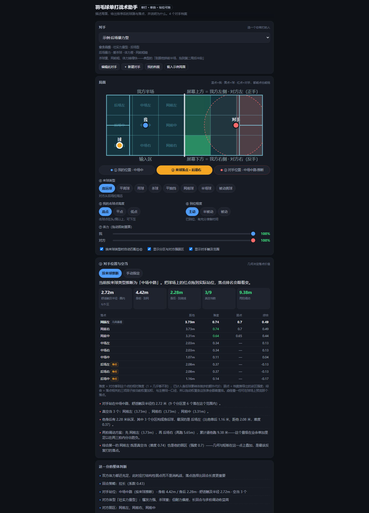

# 羽毛球单打战术助手

描述一个局面——我站在哪、球落在我这、是什么球——它给出这一拍该打什么、打到哪里，
按推荐度排好序，并且把每个分数的来路一条条列出来。

在线试用：<https://mofan-mofan.github.io/badminton-tactics/>
离线就是双击 `index.html`，不装 Node、不构建、不联网，档案存在浏览器 localStorage 里。

## 上手

先点「载入示例局面」，比对着空表单填快得多。输入只有四样：来球类型、我的击球点高度、
到位程度、双方体力。球场上蓝（我）、黄（球）、红（对手）三个点都能拖，把红点拖到对手
实际站的位置，落点排名会立刻重算。任何一条推荐展开「打分明细」，能看见 9 个因子各自
的值和权重。

## 它是怎么算的

场地用米做坐标，半场切 18 个分区。9 个因子加权出分：落点调动性、成功率、命中弱区、
自己的跑动代价、避开强区、进攻连续性、失误代价、体力差、回合偏好。权重条可以现场拖，
没有藏起来的项。

对手站位是 v0.2 加进来的：默认按来球类型推断（他挑后场，人就在后场），也可以手动拖。
站位同时改三件事——他够每个落点要多久、这一拍双方各耗多少体力、以及那张 9 个落点的
空当榜。退后接球要先转体再倒步，所以落点比他靠底线 0.35 米以上才开始加步法代价，
1 米以上才打「身后」标——没这个门槛的话他一站网前，九个区全成身后，标记就没信息量了。

## 最近更新

- 2026-09-14 · v0.2：对手站位可拖（上一节那三件事），身后球单独建模，空当榜上线。
- v0.1：只有固定站位下的单拍推荐。

## 说清楚的部分

参数是手工标定的经验值，没用真实比赛数据校准过，界面写的是"相对难度""约 94%"，
不给假的小数位。强弱区由体型加特征标签推导，可以手动覆盖。只算单打、只算一拍，
不做多拍推演，也不看比分。下一步最想做的两件事：两拍推演（引擎里已留 `likelyReply()`），
和录二十个回合把几个常数校准出来。

引擎是 UMD 的（`module.exports` / `window.BadmintonEngine`），将来搬小程序一行不用改。
打开 `index.html#selftest` 跑 12 项自检，守的是数值反了、NaN 渗进几何这类界面上看不出
来的静默失效。触摸拖拽走 Pointer Events，但没在真机上验过，这句是诚实声明。

## License

MIT。参数和你的实际经验冲突时以你为准：改 `CALIB` 那一节，跑一遍自检验收。
